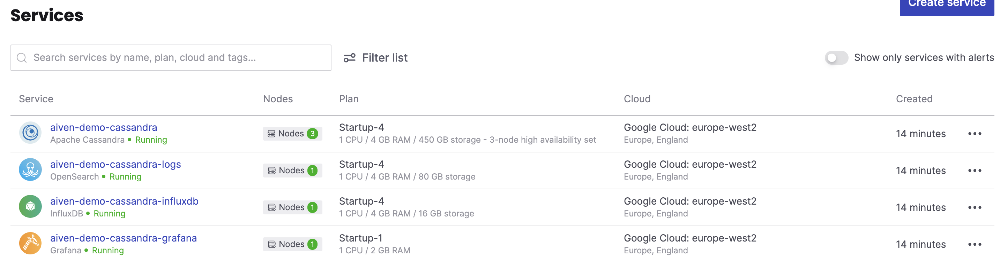

# Cassandra via Aiven Terraform Client -  Demo Instructions


## Introduction

The purpose of this demo is to show how to set up a Cassandra database, with monitoring and logging on the Aiven platform

## Requirements

[Install Terraform](https://developer.hashicorp.com/terraform/tutorials/aws-get-started/install-cli)

Java keytool (part of standard Java distribution)

## Setup

Clone this project

```bash
git clone git@github.com:ken-tune/aiven-cassandra-demo.git
```

### Cassandra CLI Tools

We will make use of cqlsh and benchmarking tool cassandra-stress. To get these, download and unpack latest Cassandra release into the project directory - see [cassandra.apache.org](https://cassandra.apache.org/_/download.html) for details. e.g.

```bash
cd aiven-cassandra-demo
wget https://dlcdn.apache.org/cassandra/4.0.12/apache-cassandra-4.0.12-bin.tar.gz 
tar xvfz apache-cassandra-4.0.12-bin.tar.gz 
```

*Note you may need to change the value of CASSANDRA_TOOLS_DIR in env.sh if the version of Cassandra is different to what is above*

### Aiven CLI tool and login token

Install the [Aiven CLI](https://aiven.io/docs/tools/cli)

An Aiven token is required in order to both use the Terraform client and authenticate the Aiven CLI. Obtain a token using [these instructions](https://docs.aiven.io/docs/platform/howto/create_authentication_token).

To store the token

```bash
cp aivenToken.sh.template aivenToken.sh	
```

Edit the file to include your token. It should read something like

```bash
# Add your Aiven token below

export TF_VAR_aiven_api_token=mDKaOFyOuRLx59316mWC4k+KTHQEe8
...
0iQfIT9rEde8wbkKoSjeoEHReBPYTbGZ5NUyjftWKjjvS+LJ7Z4+ECC+KYM=
```

### User specific data

The Aiven project deployed into will be specific to the user of this demo. We will also allow the user to set a specific password for all resources to make life easy for demo purposes. To that end two pieces of information need to be set. To do this

```bash
cp userSpecific.sh.template userSpecific.sh 
```

Edit the file. The result should be similar to	

```
AIVEN_PROJECT=my_project_name
AIVEN_SERVICE_PASSWORD=my_secret_password	
```

### Token authentication

Run avnLogin.sh. Do command-v when prompted

```bash
aiven-cassandra-demo> ./avnLogin.sh
Token is in your clipboard - just command-v to paste
User's Aiven access token: 
INFO	Aiven credentials written to: /Users/username/.config/aiven/aiven-credentials.json
```

## Running Terraform Setup

The first time you run the setup

```
terraform init
```

Followed by 

```
./setup.sh
```

This will take approximately 8 minutes

When finished your project should contain four running services as below



## Basic cqlsh interaction

To use cqlsh run `./run-cql.sh`

Sample commands

```
create keyspace mySpace with replication = {'aiven': '3', 'class': 'org.apache.cassandra.locator.NetworkTopologyStrategy'} and durable_writes=true;

create table mySpace.myTable(id int PRIMARY KEY,value text);

insert into myspace.myTable(id,value) values(1,'Hello World');
```

## B
